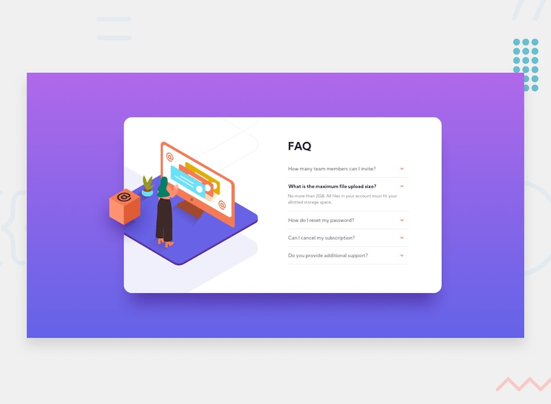

# Frontend Mentor - FAQ Accordion Card

To see the live project go [here](https://faq-accordion-card-mbart13.vercel.app/).

This is another newbie challenge from https://www.frontendmentor.io, where goal is to make the page looking as close to the design as possible.
This one was more challenging than I thought, it took me a few attempts to position those images correctly in both mobile/desktop view. I also learned how important is keyboard accesibility for pages like this.

In this project I used:
- SASS
- Flexbox
- pseudo-elements for styling
- a little bit of JavaScript for user interaction
